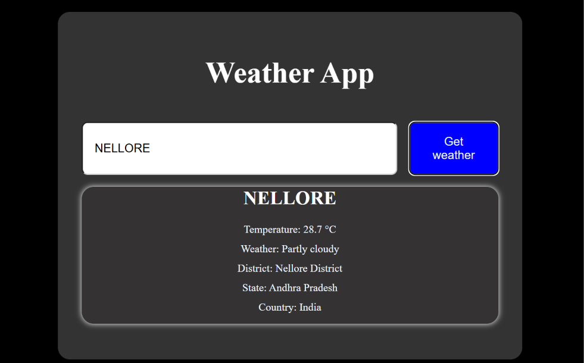

# Weather App

A simple weather application built using HTML, CSS and JavaScript.

## Features

- Search weather by city
- Shows temperature
- Shows weather condition
- Shows district, state and country

## Technologies Used

- HTML
- CSS
- JavaScript
- Open-Meteo API

## How to Use

1. Enter a city name.
2. Click "Get Weather".
3. The current weather will be displayed.

## preview

